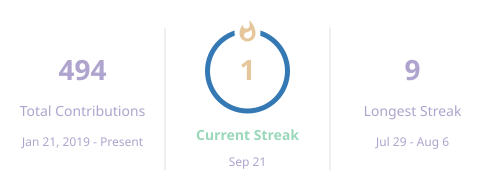
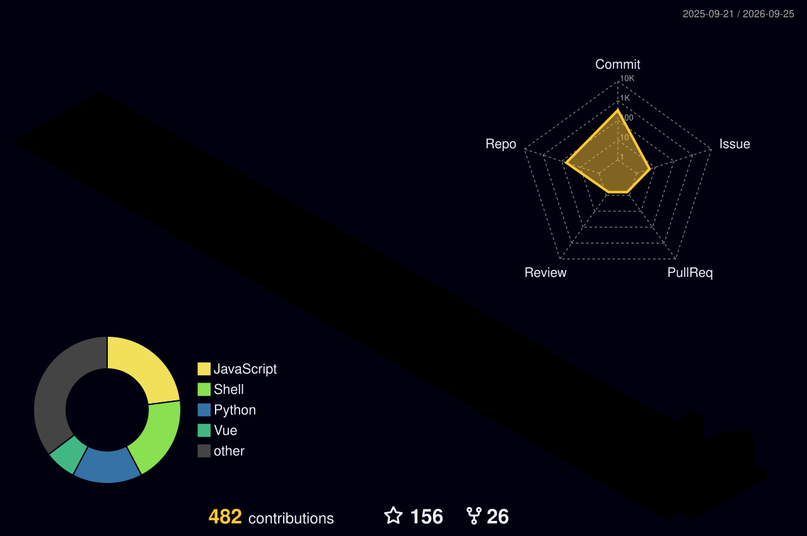

---
<!-- 副标题使用优雅的冰霜紫 (AFA4CE) 点缀 -->
<h3 align="center" style="color:#AFA4CE;">
  Linux / ARMv7 Developer · Docker Builder · Network Engineer
</h3>

 

<!-- 旗舰机配色徽章 (云杉绿、旷野棕、海湾蓝、冰霜紫、晨曦金) -->

  
  
  
  
  

 

<!-- 核心对称排版：无多余边框与链接 -->

  <!-- 暗黑模式展示这组 -->
  
  
  
  <!-- 白天模式展示这组 -->
  
  

<!-- 连击卡片居中 -->

  

 

| # | Category | Icons |
|---|---|---|
| 🔤 | **Frontend** |  |
| 🎨 | **Backend** |  |
| ⚙️ | **DevOps** |  |
| 🚀 | **Server** |  |
| 💎 | **System** |  |
| 📬 | **Contact** |  |

 
<!-- 贪吃蛇居中展示 -->

  
  

 

<picture>
    <source media="(prefers-color-scheme: dark)" srcset="./profile-3d-contrib/profile-night-rainbow.svg" />
    
  </picture>

 
 

  <!-- 底部签名徽章使用薄荷绿 (9AD8BA) 呼应 -->
  

